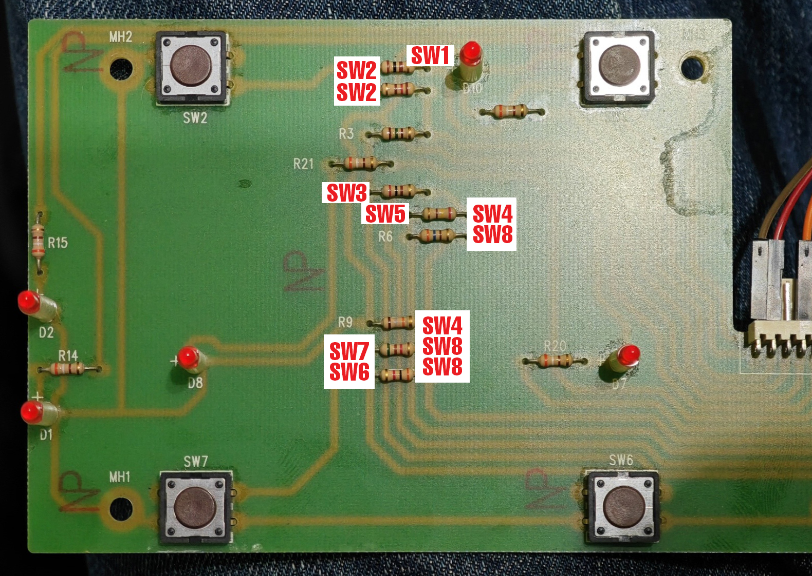
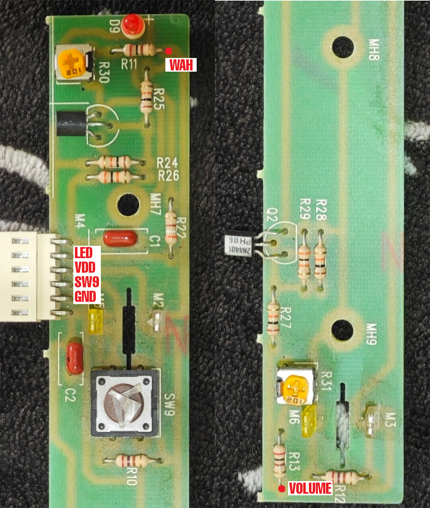
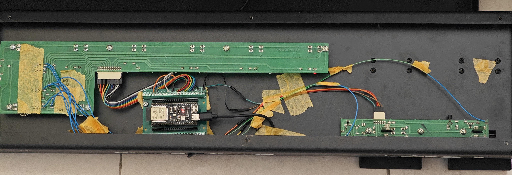
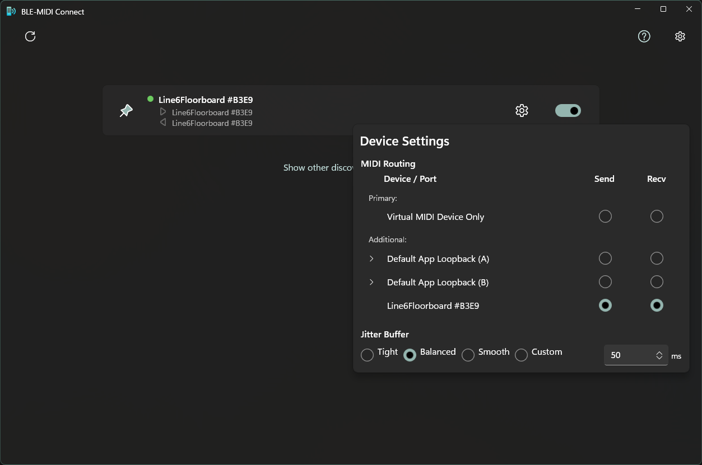

# Line6 Floorboard ESP32-S3 BLE MIDI Controller

This project turns a Line6 Floorboard into a wireless **BLE MIDI** foot controller using an **ESP32-S3**. It can also be adapted to a custom controller with footswitches, LEDs, and two expression pedals.

The firmware sends MIDI to the computer and also listens for MIDI feedback from the DAW, so the pedalboard LEDs can follow the DAW/plugin state.

## Features

- Wireless **BLE MIDI** controller for Windows
- 9 footswitch inputs with matching LED feedback
- 2 expression pedal inputs with smoothing and stable MIDI output
- Bidirectional MIDI CC support:
  - footswitches send CC messages to the DAW
  - DAW feedback CC messages can update the pedalboard LEDs
- Persistent pedal calibration stored in flash
- Runtime pedal calibration from the pedalboard
- Connection LED behavior:
  - blinks while disconnected
  - stays on while connected

## MIDI Mapping

The firmware uses zero-based channel numbering internally. `MIDI_CHANNEL = 15` means MIDI channel 16 in your DAW.

### Outgoing Messages

| Control | MIDI CC | Rule |
| --- | ---: | --- |
| TUNER | 102 | off = 0, on = 127 |
| CHANNEL SEL | 103 | off = 0, on = 127 |
| A | 104 | off = 0, on = 127 |
| B | 105 | off = 0, on = 127 |
| C | 106 | off = 0, on = 127 |
| UP | 107 | off = 0, on = 127 |
| DOWN | 108 | off = 0, on = 127 |
| D | 109 | off = 0, on = 127 |
| WAH switch | 110 | off = 0, on = 127 |
| Wah / modulation pedal | 1 | 0 to 127 |
| Volume pedal | 7 | 0 to 127 |

### Incoming DAW Feedback

The pedalboard listens for incoming **Control Change** messages on the same MIDI channel and footswitch CC numbers:

- channel: MIDI channel 16
- CC range: 102 to 110
- value `0`: LED off
- value `> 0`: LED on

Incoming CC feedback updates the stored local footswitch state too. This keeps the pedalboard and DAW in sync, so the next physical press toggles from the state last sent by the DAW.

Only footswitch CC feedback is used for LED sync. Incoming note, program change, pitch bend, and expression pedal CC messages are ignored.

## Enabling LED Feedback In The DAW

MIDI feedback usually has to be enabled in the DAW or plugin host. MIDI Learn often maps the pedalboard as an input only; that is enough for controlling software, but not enough for lighting the pedalboard LEDs from the software state.

To make the pedalboard LEDs follow the DAW, configure the mapped DAW controls to **transmit their value back** to the BLE MIDI device.

Tested setup in **Studio One Pro 8**:

1. Open **External Devices**.
2. Register/map the pedalboard button using **Learn**.
3. While **Learn** is enabled, right click the registered button/control.
4. Enable **Transmit value**.

After that, when the DAW function changes state, Studio One sends the matching CC value back to the pedalboard and the corresponding LED updates.

Other DAWs may use different names for the same feature, such as MIDI feedback, send value, transmit value, output to controller, or controller feedback.

## Hardware Modifications

### Footswitch Board

1. Remove the resistors at the highlighted locations in the central part of the board and solder wires to the indicated switch points. Pads with the same SW number are already shorted together, so use whichever pad is most convenient.

   

2. Connect each switch wire to the ESP32-S3 GPIO pins used by the sketch.

3. Use continuity or diode mode between GND and each pin of the onboard LED connector to identify the LED pins. If an LED does not light while probing, test between GND and the board-side pad of its resistor instead of directly at the LED.

The onboard LEDs already have current-limiting resistors, so the ESP32 only needs the GPIO connections, power, and GND.

### Expression Pedals And Wah

1. Solder wires to each pedal potentiometer output, VCC, and GND. Also tap the onboard connector for the wah LED pin if needed.

   

2. Connect the pedal wires to the ESP32-S3 pins used by the sketch.

The completed board should look similar to this. More closeups are available in the `hw modifications` folder.

## Software Setup

1. Install **Arduino IDE** and the **ESP32 board package**.
2. Select **ESP32S3 Dev Module**.
3. Install the BLE MIDI library used by this project:

   [ESP32-BLE-MIDI-NimBLE2](https://github.com/znk-ee/ESP32-BLE-MIDI-NimBLE2)

   This fork keeps the original ESP32 BLE MIDI API style while working with current NimBLE-Arduino 2.x versions.

4. Install **BLE-MIDI Connect** from the Microsoft Store:

   [BLE-MIDI Connect](https://apps.microsoft.com/detail/9NVMLZTTWWVL)

5. Install **Windows MIDI Services**:

   [Windows MIDI Services](https://microsoft.github.io/MIDI/)

Recent versions of BLE-MIDI Connect make loopMIDI unnecessary for this project. Windows MIDI Services is still recommended for the current Windows MIDI workflow.

## Uploading

Upload `HACKEDLine6Floorboard.ino` to the ESP32-S3.

Recommended Arduino IDE starting point:

- Board: `ESP32S3 Dev Module`
- Flash Size: match your module, for example `16MB` on an N16R8 board
- Partition Scheme: one of the matching 16 MB layouts if using 16 MB flash
- PSRAM: enable it if your module has PSRAM
- CPU Frequency: `240MHz`

Always verify ESP32-S3 reserved pins before wiring. Some GPIOs may be used internally for flash, PSRAM, USB, boot strapping, or other board functions. On some ESP32-S3 WROOM variants, GPIO35, GPIO36, and GPIO37 may be reserved.

## Usage

1. Power on the pedalboard.
2. Open BLE-MIDI Connect.
3. Connect to `Line6Floorboard`.
4. In the DAW or plugin host, select the BLE MIDI endpoint as an input.
5. Use MIDI Learn to assign footswitches and pedals.
6. For LED feedback from the DAW, enable the DAW/software option that transmits mapped control values back to the pedalboard.

## Pedal Calibration

Calibration is built into the firmware and does not require editing the code. It can be started at boot or while the controller is already running.

To enter calibration, hold **TUNER + CHANNEL SEL** for about 1.5 seconds.

Calibration flow:

1. Move both pedals to one end-stop.
2. Press **TUNER** to capture the first endpoint.
3. Move both pedals to the opposite end-stop.
4. Press **CHANNEL SEL** to capture the second endpoint.
5. The firmware saves the values automatically.

LED guidance during calibration:

- WAH blinks during the whole calibration process.
- TUNER blinks for the first capture.
- CHANNEL SEL blinks for the second capture.
- All footswitch LEDs blink when calibration finishes.

Calibration is stored in flash, so it survives reboots and power loss. The firmware reads pedals in millivolts, then filters them with oversampling, trimmed averaging, and a moving average.

## Firmware Notes

- Footswitches are active-low using `INPUT_PULLUP`.
- Footswitch state is stored as one bit per button.
- Local button presses and incoming DAW CC feedback both update the same stored button state.
- Pedal CC messages are only sent when connected and when the filtered MIDI value changes enough to pass the deadband.
- On reconnect, pedal values are resent.

## Changelog

### Latest

- Added incoming BLE MIDI Control Change handling for DAW-controlled LED feedback.
- DAW feedback now updates the stored local button state.
- Changed connection status LED behavior:
  - blinking means disconnected
  - solid on means connected
- Kept outgoing footswitch and expression pedal MIDI behavior unchanged.

### Earlier

- Added firmware pedal calibration.
- Added persistent calibration storage using flash preferences.
- Switched pedal reading to `analogReadMilliVolts()`.
- Added explicit ADC setup.
- Improved pedal stability with oversampling, trimmed mean, and moving average filtering.
- Added runtime calibration trigger.
- Added calibration LED guidance.
- Updated Windows setup to use BLE-MIDI Connect and Windows MIDI Services.
- Updated the recommended BLE MIDI library to ESP32-BLE-MIDI-NimBLE2.

## Credits

- Original Line6 Floorboard hardware
- BLE-MIDI Connect by locomorange
- Windows MIDI Services by Microsoft
- ESP32-BLE-MIDI-NimBLE2 compatibility fork for newer NimBLE versions
